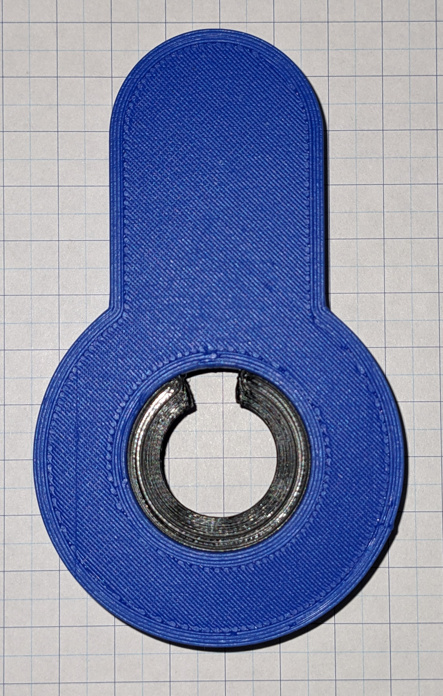

# V1 Educational Lock Notes

To assemble this model, you will need to print six parts and a spring. I used a 3/8-inch by 1 1/4-inch spring from my local hardware store.

I recommend using four colors of filament.

Color 1: 

	Lock Body
	Lock Ring

Color 2:

	Lock Core
	Lock Clip

Color 3:

	Top Pin
	Spool Pin (Alternative to the normal Top Pin)

Color 4:

	Bottom Pin

Construction:
Press the Lock Ring into the Lock body with the slopped edge to the back of the lock and the notch at the 12 o'clock position. Use a small amount of super glue on the inside of the lock to affix the ring to the body. 

Use the lock body to center the lock clip to the lock core and glue the clip to the core. With the core in the locked position, I recommend the clip's tab be in the 5 o'clock position. The clip/ring prevents the lock from accidentally coming apart during use.
See Figure 2.

 
This work is licensed under <a href="https://creativecommons.org/licenses/by-nc-sa/4.0/?ref=chooser-v1" target="_blank" rel="license noopener noreferrer" style="display:inline-block;">Creative Commons Attribution-NonCommercial-ShareAlike 4.0 International</a>
 
