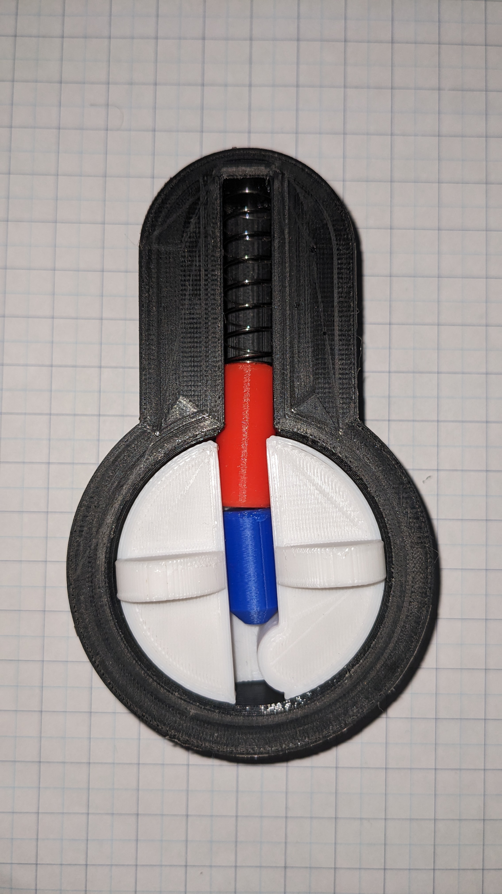

# V2 Educational Lock Notes

To assemble this model, you must print five parts and a spring. I used a 10mm by 30mm spring with a thickness of 0.5mm. You don't want the spring to be too stiff or the lock will be difficult to demo.

I recommend using four colors of filament.

Color 1: 

	Lock Body

Color 2:

	Lock Core
	Lock Clip

Color 3:

	Top Pin
	Spool Pin (Alternative to the normal Top Pin)

Color 4:

	Bottom Pin

Construction:

Use the lock body to center the lock clip to the lock core and glue the clip to the core. With the core in the locked position, I recommend the clip's tab be in the 5 o'clock position. The clip/ring prevents the lock from accidentally coming apart during use.

Assembly:
1. Insert the Bottom pin into the lock core.
2. Insert the spring into the top of the lock body.
3. Insert the Top Pin (or Spool Pin) into the top of the Lock Body. Compressing the spring so you can insert the Lock Core into the Lock body.

4. Twist the Lock Core until the Clip aligns with the gap in the Lock Ring and fully seat the core.

 
This work is licensed under <a href="https://creativecommons.org/licenses/by-nc-sa/4.0/?ref=chooser-v1" target="_blank" rel="license noopener noreferrer" style="display:inline-block;">Creative Commons Attribution-NonCommercial-ShareAlike 4.0 International</a>
 
